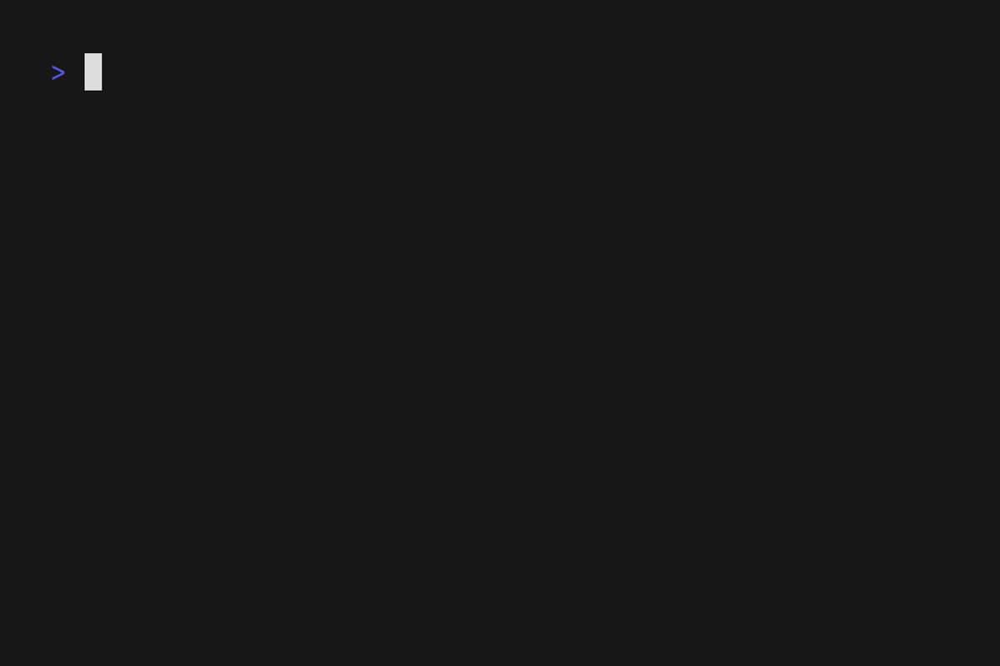

# OSC
OSC is a collection of OSSD Mark Calculator written in different programming languages.

The OSSD Mark Calculator is my first coding project and has been my go-to project when I first learn a language

## Variants
- Python: [osc-py](./osc-py)
- C++: [osc-cpp](./osc-cpp)
- Go: [osc-go](./osc-go)

## Demo

